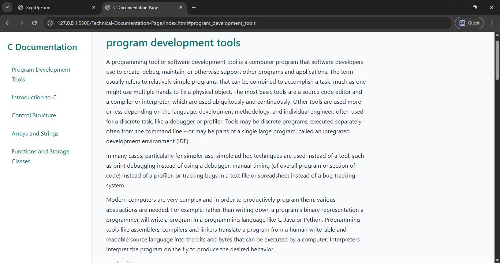

# Technical-Documentation-Page'C'

## Table of contents

- [Overview](#overview)
  - [The challenge](#the-challenge)
  - [Screenshot](#screenshot)
  - [Links](#links)
  - [Built with](#built-with)
- [Author](#author)

## Overview

A technical documentation page for C programming concepts, structured with semantic HTML, CSS Grid, and clean typography for readability. This project satisfies the FreeCodeCamp Responsive Web Design project requirements.

### The challenge

- Create a technical documentation page with:
  - Fixed side navigation with anchor links
  - Responsive layout
  - Code blocks
  - Clean visual hierarchy

### Screenshot

### Links

- Live Site URL: [live URL](https://shrikanth-dev.github.io/Technical-Documentation-Page/)
- Solution URL: [solution URL](https://github.com/shrikanth-dev/Technical-Documentation-Page)

### Built with

- HTML5
- CSS Grid & Flexbox
- Vanilla CSS

## Author

- LinkedIn - [@G Srikanth](https://www.linkedin.com/in/g-srikanth-gs)
